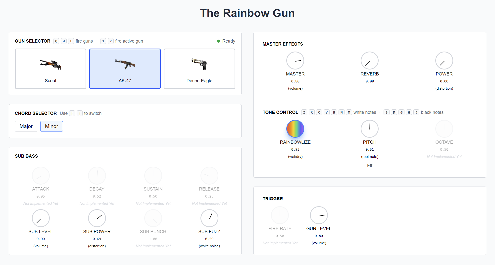

# Rainbow Gun

An interactive web-based musical instrument that transforms gunshot samples into playable melodies with real-time effects processing.

**Try it live:** [https://rainbow-gun.pages.dev/](https://rainbow-gun.pages.dev/)
**Watch the demo video:** [YouTube](https://youtu.be/jqQePmCB2a0&t=241s)



## Prerequisites

- Node.js (v20.9.0 or higher), which typically includes npm

## Setup

1. Navigate to the sub-directory `/rainbow-gun` that contains the web-application:
```bash
cd rainbow-gun
```

2. Install dependencies:
```bash
npm install
```

3. Run the development server:
```bash
npm run dev
```

4. Open [http://localhost:3000](http://localhost:3000) in your browser

## Controls

### Keyboard Controls
- **Z X C V B N M** - Piano keys (white notes: C D E F G A B)
- **S D G H J** - Piano keys (black notes: C# D# F# G# A#)
- **[ ]** - Switch between major/minor chords
- **Q W E** - Fire Scout/AK-47/Desert Eagle
- **1 2** - Fire currently active gun

### Mouse Controls
- Drag on any knob to adjust values
- Knobs show visual feedback during adjustment

### MIDI Controller (with our Rainbow Gun)
- Use the 15 knobs on the Rainbow Gun to control parameters
- Use the trigger keys to fire guns

## Features

- **3 Featured Gunshot Samples**: Scout, AK-47, Desert Eagle
- **Wet/Dry Mix**: Blend between original and pitched samples
- **Sub Bass Synthesis**: Adds low-end punch to each shot
- **Master Effects**: Volume, reverb and distortion
- **Chord System**: Major/minor chord selection across 12 pitches
